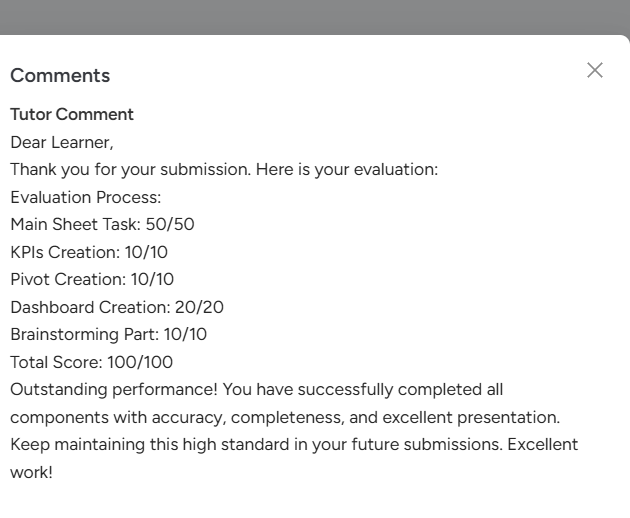

# Strategic Sales & Operations performance Dashboard (Excel Project)

## Overview

 This project showcases a strategic sales and operations dashboard built in Microsoft Excel, using datasets across orders, products, regions, and customers to deliver a comprehensive business view.

The dashboard leverages advanced Excel techniques such as Pivot Tables for data aggregation, XLOOKUP and VLOOKUP for efficient data mapping, and calculated metrics to evaluate performance.

---

## Tools & Techniques Used
- Microsoft Excel
- Pivot Tables
- XLOOKUP / VLOOKUP / HLOOKUP
- Data Cleaning & Transformation
- Data Visualization

---

## Key Performance Indicators (KPIs)
- Total Revenue
- Fast Delivery Rate
- Top Performing Region
- Highest Selling Product (by Units)
- Highest Revenue Product

---

## Dashboard Preview

This dashboard provides a consolidated view of business performance including revenue trends, regional analysis, delivery efficiency, and product insights.

---

## Graphical Analysis

### 1. Region-wise Product Sales

Shows how product sales vary across different regions.

---

### 2. Monthly Sales Trend

Displays sales performance over time and highlights seasonal patterns.

---

### 3. Regional Average Delivery Time

Analyzes delivery efficiency across regions.

---

### 4. Order Status Analysis

Shows distribution of delivered, pending, and cancelled orders.

---

## Project File

Strategic-Sales-Operations-Performance Dashboard.xlsx

## Evaluation & Feedback

This project received a *100/100* evaluation from the instructor, recognizing its strong analytical approach, effective use of Excel functions, and clear business insights.

> "Excellent dashboard with clear insights and strong use of Excel techniques."

---

## Key Insights
- North region generates the highest revenue  
- Sales peak during May and November  
- Smartphones are the highest revenue-generating product  
- Leg Set leads in unit sales  
- Approximately 30% cancellation rate indicates operational inefficiency  

---

## Conclusion

This dashboard provides a consolidated view of sales performance across regions, products, and time. It highlights key metrics, revenue trends, delivery efficiency, and order status to support data-driven decision-making.

## Author
Trishula Mitra
